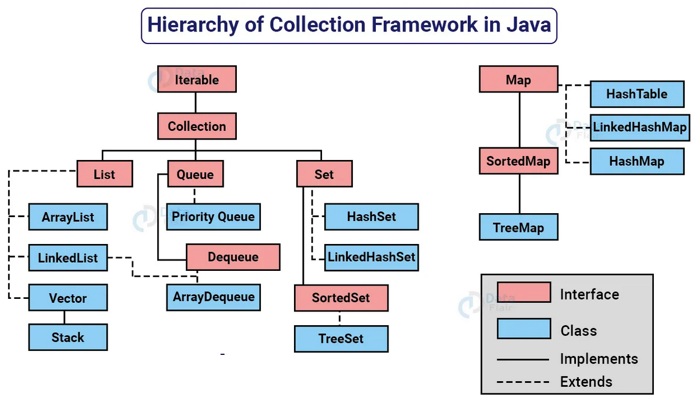

# Introdução
É um conjunto de interfaces, classes e algoritmos do Java para trabalhar com grupos de dados, oferecendo:
- Listas
- Conjuntos
- Filas
- Mapas
Com o intuito de facilitar o armazenamento, busca, organização, remoção e manipulação dos dados. Po exemplo:
Quando temos um valor, o armazenamos em uma variável
```java
int idade = 19;
```
Porém quando se tem um número expressivo de dados e de diversoso tipos(nome, idade, cidade, estado civil, etc) utilizamos esse framework. Antes da existência dela, trabalhar com muitos dados era uma tarefa extremamente limitado e bagunçado, com isso, a JCF veio para tornar o trabalho facilitado e padronizado, com isso ao compartilhar o código com a JFC, os desenvolvedores vão saber trabalhar. 

## O que a compõem?
### Interfaces(Interface)
Como vistos em POO, interfaces são um contrato que definem o que uma coleção(no caso do JCF) deve ser capaz de fazer.
- List
- Queue
- Set
- Map

### Implementações(Class)
São aqueles que farão o trabalho ditado pela interface.
- ArrayList
- LinkedList
- HashSet
- TreeSet
- PriorityQueue
- HashMap
- TreeMap

Adendo: Embora Map não faça parte da Interface de **Collection**, por ter uma função muito parecida com as outras interfaces, ela ainda faz parte do Framework. 
Adendo2: Cast ou Casting em Java é uma maneira de transformar um objeto de um tipo em outro tipo, por exemplo. Int para String. É uma prática a não ser seguida pois demanda tempo de execução e memória.
Adendo3: Todas essas implementações fazem parte do pacote **java.util**

## Generic Types(Tipos Genéricos)
É um recurso em Java que permite definir o tipo de dado que uma classe, interface ou método irá trabalhar quando for utilizada, tornando o código mais seguro, evitando erros, eliminando a necessidade de casting e aumentando a reutilização.
Por exemplo:
```java
class Caixa<T> {
    private T item;

    public void guardar(T item) {// método set
        this.item = item;
    }

    public T pegar() {// método get
        return item;
    }
}
// T é o tipo de dado que será definido depois
```
O símbolo <> é chamado de "diamond" ou "diamond operator" foi um recurso introduzido no Java 7 e é usado no contexto de tipos genéricos em Java para inferir automaticamente o tipo com base no contexto.
Tendo isso em mente, ao utilizar essa classe. Nós utilizamos o chamado **Wrappers**, que representam esses tipos primitivos como objetos e elas são classes já prontas do próprio Java. Então por exemplo:
|Tipo Primitivo|Wrapper|
|--------------|-------|
|int|Integer|
|double|Double|
|boolean|Boolean|
|char|Character|
|-|String|

Eles já são considerados objetos, e com isso vemos que o Generics apenas trabalha com Objetos. Então se quisermos instanciar a classe generic Caixa, parametrizamos ela com o Wrapper String, por exemplo:
```java
Caixa<String> caixa = new Caixa<>();
caixa.guardar("Carrinho");	
String nome = caixa.pegar();
```
Além disso, também podemos utilizar tipos criados por nós (classes) quando precisamos representar mais de uma informação. Por exemplo
```java
class Brinquedo {
    String nome;
    int quantidade;

    public Brinquedo(String nome, int quantidade) {
        this.nome = nome;
        this.quantidade = quantidade;
    }
} //Estamos criando o Wrapper/classe Brinquedo
// Para então usar no Generic

Caixa<Brinquedo> caixa = new Caixa<>();

caixa.guardar(new Brinquedo("Carrinho", 5));

Brinquedo b = caixa.pegar();

System.out.println(b.nome);
System.out.println(b.quantidade);
```

# Comparable x Comparator
Ambos são mecanismos utilizados para definir a ordenação de coleções de objetos em Java. A principal diferença entre eles está na forma como essa ordenação é definida e aplicada.
- O Comparable define uma ordem natural padrão dentro da própria classe, através do método **compareTo**.
- Já o Comparator permite definir diferentes estratégias de ordenação externas à classe, podendo inclusive utilizar múltiplos atributos para comparação.

Resumindo:
O Comparable define uma ordem natural padrão diretamente na própria classe do objeto. Já o Comparator permite definir diferentes estratégias de ordenação externamente, sem necessidade de modificar a classe original.

*Pensando na prática:*
```java
List<Produto> produtos;
```
Considerando a coleção acima, estamos lidando com objetos do tipo Produto. Para que seja possível ordená-los, é necessário definir como um objeto Produto deve ser comparado com outro.
Essa lógica pode ser implementada de duas formas: dentro da própria classe (Comparable) ou fora dela (Comparator).

## Comparable (implementação interna)
O Comparable é implementado na própria classe que será ordenada. Isso significa que a classe define sua própria regra de comparação, considerada como a ordem padrão. Não sendo possível definir mais de um tipo de ordenação.
Ex.:
```java
public class Pessoa implements Comparable<Pessoa>{
    private String nome;
    private int idade;
    private double altura;
    

    Pessoa(String nome, int idade, double altura){
        this.nome = nome;
        this.idade = idade;
        this.altura = altura;
    }
    @Override
    public int compareTo(Pessoa p){//comparable
        return Integer.compare(idade, p.getIdade());
    }
}
//Nesse exemplo, a classe Pessoa define 
//que sua ordenação natural será baseada no atributo idade.
```
Ao usar:
```java
Collections.sort(pessoas);
```
A ordenação será feita automáticamente utilizando o método do **compareTo**

## Comparator (Implementação Externa)
O Comparator permite definir regras de ordenação fora da classe, sem modificar a classe original e permitindo múltiplas estratégias de ordenação. Isso é útil quando há necessidade de múltiplos critérios de ordenação ou quando não se pode modificar a classe original.
E usando o mesmo exemplo do comparable, adicionamos fora da classe Pessoa uma nova classe:
```java
class comparatorPorAltura implements Comparator<Pessoa>{ //comparator
    @Override
    public int compare(Pessoa p1,Pessoa p2){
        return Double.compare(p1.getAltura(), p2.getAltura());
    }
}
```
Aplicamos
```java
Collections.sort(pessoas, comparatorPorAltura);//ou
pessoas.sort(new comparatorPorAltura());//ou
Comparator<Pessoa> comparator = new comparatorPorAltura();
pessoas.sort(comparator);
```
Note que definimos um segundo parâmetro para o Collections.sort, pois não iremos usar o Comparable criado dentro da classe e sim o Comparator que foi criado fora da classe.

|Comparable|Comparator
|-----------------|------------------|
|Definido dentro da classe|Definido fora da classe|
|Ordem natural padrão|Ordem customizada|
|Método compareTo|Método compare|
|Usado diretamente no sort|Passado como parâmetro|

- O **Comparable** deve ser utilizado quando existe uma única forma padrão de ordenação para a classe e quando é possível modificá-la.
- O **Comparator** deve ser utilizado quando há necessidade de múltiplas formas de ordenação ou quando a classe não pode ser alterada.

# Aprofundando em List
A interface list é uma coleção ordenada que permite a inclusão de elementos, inclusive elementos duplicados. Um dos tipos de inclusão mais utilizados no Java e suas classes mais comumente usadas são as *ArrayList* e a *LinkedList*. Essa List se assemelha à uma matriz de comprimento dinâmico, permitindo adição e remoção de elementos, fornecendo métodos úteis para essas tarefas com base nos índices. A classe Collections fornece algoritmos úteis para manipulação de List, como ordenação (sort), embaralhamento (shuffle), reversão (reverse) e busca binária (binarySearch).

- **ArrayList**: O ArrayList é uma implementação da interface List que armazena os elementos em uma estrutura de array redimensionável. Isso significa que ele pode crescer automaticamente à medida que novos elementos são adicionados. A principal vantagem do ArrayList é o acesso rápido aos elementos por meio de índices, o que permite recuperar um elemento específico de forma eficiente. No entanto, adicionar ou remover elementos no meio da lista pode ser mais lento, pois requer a realocação de elementos.

- **LinkedList**: O LinkedList é uma implementação da interface List que armazena os elementos em uma lista duplamente vinculada. Cada elemento contém referências para o elemento anterior e próximo na lista. A principal vantagem do LinkedList é a eficiência na adição ou remoção de elementos no início ou no final da lista, pois não é necessário realocar elementos. No entanto, o acesso aos elementos por meio de índices é mais lento, pois requer percorrer a lista até o elemento desejado.

- **Vector**: O Vector é uma implementação antiga da interface List que é semelhante ao ArrayList, mas é sincronizada, ou seja, é thread-safe. Isso significa que várias threads podem manipular um objeto Vector ao mesmo tempo sem causar problemas de concorrência. No entanto, essa sincronização adiciona uma sobrecarga de desempenho, tornando o Vector menos eficiente do que o ArrayList em cenários em que a concorrência não é um problema. Por esse motivo, o uso do Vector é menos comum em aplicações modernas.

